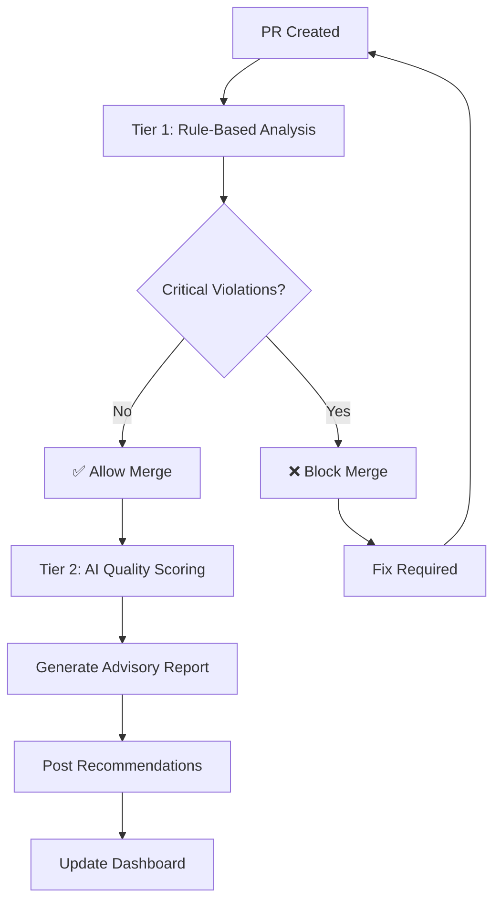
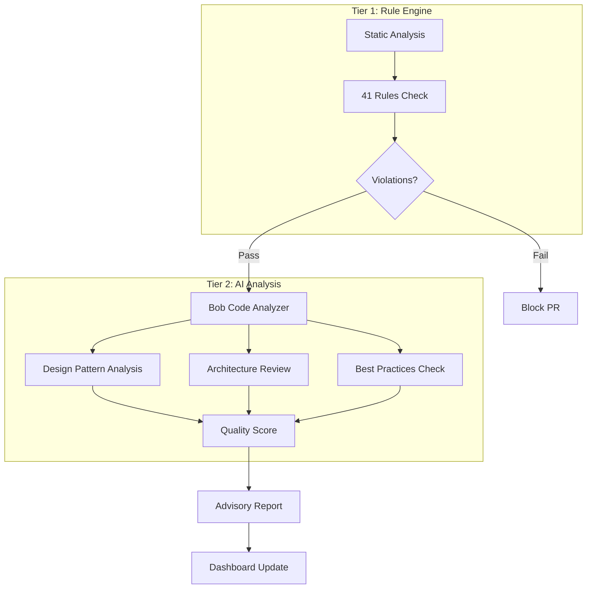

# 🤖 AI-Enhanced Code Quality Scoring System

## Overview

This document outlines the **Phase 2 enhancement** that adds Bob-powered intelligent code analysis on top of the core rule-based system. This provides **advisory recommendations** that help developers improve code quality without blocking merges.

---

## 🎯 Key Principles

### Two-Tier Analysis System



### Tier 1: Rule-Based (Blocking)
- **Purpose**: Enforce critical standards
- **Action**: Block merge if violations found
- **Focus**: Security, bugs, critical quality issues
- **Response Time**: Fast (< 30 seconds)

### Tier 2: AI-Enhanced (Advisory)
- **Purpose**: Suggest improvements
- **Action**: Provide recommendations, never block
- **Focus**: Design patterns, architecture, best practices
- **Response Time**: Moderate (1-2 minutes)

---

## 🏗️ Enhanced Architecture



---

## 📊 AI Quality Scoring Framework

### Score Categories (0-100 scale)

#### 1. Design Patterns Score (25 points)
- **SOLID Principles** adherence
- **Design Pattern** usage appropriateness
- **Code organization** and structure
- **Separation of concerns**

#### 2. Architecture Score (25 points)
- **Layering** and modularity
- **Dependency management**
- **Coupling** and cohesion
- **Scalability** considerations

#### 3. Code Quality Score (25 points)
- **Readability** and clarity
- **Maintainability** metrics
- **Complexity** analysis
- **Documentation** quality

#### 4. Best Practices Score (25 points)
- **Java idioms** usage
- **Performance** considerations
- **Error handling** patterns
- **Testing** approach

### Overall Score Interpretation

| Score Range | Grade | Meaning | Action |
|-------------|-------|---------|--------|
| 90-100 | A+ | Excellent | Minimal suggestions |
| 80-89 | A | Very Good | Minor improvements |
| 70-79 | B | Good | Some enhancements recommended |
| 60-69 | C | Acceptable | Multiple improvements suggested |
| 50-59 | D | Needs Work | Significant refactoring advised |
| 0-49 | F | Poor | Major redesign recommended |

---

## 🔧 Implementation Strategy

### Phase 2A: Bob Integration (2-3 hours)

#### 1. Bob API/Shell Selection

**Option A: Bob API** (Recommended)
```python
import requests

class BobCodeAnalyzer:
    def __init__(self, api_key):
        self.api_key = api_key
        self.base_url = "https://bob-api.ibm.com/v1"
    
    def analyze_code_quality(self, code, context):
        """Get comprehensive quality analysis from Bob"""
        prompt = self.build_analysis_prompt(code, context)
        response = self.call_bob_api(prompt)
        return self.parse_quality_score(response)
```

**Option B: Bob Shell Integration**
```python
import subprocess

class BobShellAnalyzer:
    def analyze_via_shell(self, file_path):
        """Use Bob CLI for analysis"""
        cmd = f"bob analyze --file {file_path} --format json"
        result = subprocess.run(cmd, shell=True, capture_output=True)
        return json.loads(result.stdout)
```

**Option C: Bob SDK** (If available)
```python
from ibm_bob import CodeAnalyzer

analyzer = CodeAnalyzer(api_key="your-key")
result = analyzer.analyze_file("MyClass.java")
```

#### 2. Analysis Prompts

**Design Pattern Analysis Prompt**:
```python
DESIGN_PATTERN_PROMPT = """
Analyze this Java code for design pattern usage and SOLID principles:

Code:
```java
{code}
```

Context:
- File: {file_path}
- Class Purpose: {purpose}
- Dependencies: {dependencies}

Evaluate:
1. SOLID Principles adherence (0-100)
   - Single Responsibility
   - Open/Closed
   - Liskov Substitution
   - Interface Segregation
   - Dependency Inversion

2. Design Patterns (0-100)
   - Appropriate pattern usage
   - Pattern implementation quality
   - Missing beneficial patterns

3. Provide specific recommendations for improvement

Format response as JSON:
{
  "solid_score": 85,
  "pattern_score": 75,
  "recommendations": [...],
  "examples": [...]
}
"""
```

**Architecture Analysis Prompt**:
```python
ARCHITECTURE_PROMPT = """
Review the architectural quality of this Java code:

Code:
```java
{code}
```

Project Structure:
{project_structure}

Analyze:
1. Layering and Modularity (0-100)
2. Dependency Management (0-100)
3. Coupling and Cohesion (0-100)
4. Scalability Considerations (0-100)

Provide:
- Overall architecture score
- Specific issues found
- Improvement suggestions
- Refactoring recommendations

Return JSON format.
"""
```

**Best Practices Prompt**:
```python
BEST_PRACTICES_PROMPT = """
Evaluate Java best practices in this code:

Code:
```java
{code}
```

Check:
1. Java idioms and conventions
2. Performance considerations
3. Error handling patterns
4. Resource management
5. Concurrency handling
6. Testing approach

Score each area 0-100 and provide specific examples of:
- What's done well
- What could be improved
- How to improve it

Return structured JSON.
"""
```

#### 3. Scoring Algorithm

```python
class QualityScorer:
    def __init__(self, bob_analyzer):
        self.bob = bob_analyzer
        self.weights = {
            'design_patterns': 0.25,
            'architecture': 0.25,
            'code_quality': 0.25,
            'best_practices': 0.25
        }
    
    def calculate_overall_score(self, code, context):
        """Calculate comprehensive quality score"""
        
        # Get individual scores from Bob
        design_score = self.bob.analyze_design_patterns(code, context)
        arch_score = self.bob.analyze_architecture(code, context)
        quality_score = self.bob.analyze_code_quality(code, context)
        practices_score = self.bob.analyze_best_practices(code, context)
        
        # Calculate weighted average
        overall = (
            design_score * self.weights['design_patterns'] +
            arch_score * self.weights['architecture'] +
            quality_score * self.weights['code_quality'] +
            practices_score * self.weights['best_practices']
        )
        
        return {
            'overall_score': round(overall, 2),
            'grade': self.get_grade(overall),
            'breakdown': {
                'design_patterns': design_score,
                'architecture': arch_score,
                'code_quality': quality_score,
                'best_practices': practices_score
            },
            'recommendations': self.aggregate_recommendations(
                design_score, arch_score, quality_score, practices_score
            )
        }
    
    def get_grade(self, score):
        """Convert score to letter grade"""
        if score >= 90: return 'A+'
        if score >= 80: return 'A'
        if score >= 70: return 'B'
        if score >= 60: return 'C'
        if score >= 50: return 'D'
        return 'F'
```

---

## 📋 Advisory Report Format

### GitHub PR Comment Structure

```markdown
## 🤖 AI Code Quality Analysis

### Overall Score: 85/100 (Grade: A)

Your code passes all critical checks! ✅ Here are some suggestions to make it even better:

---

### 📊 Score Breakdown

| Category | Score | Grade | Status |
|----------|-------|-------|--------|
| 🎨 Design Patterns | 88/100 | A | ✅ Excellent |
| 🏗️ Architecture | 82/100 | A | ✅ Very Good |
| ✨ Code Quality | 85/100 | A | ✅ Very Good |
| 📚 Best Practices | 85/100 | A | ✅ Very Good |

---

### 💡 Recommendations (Non-Blocking)

#### 🎨 Design Patterns (Score: 88/100)

**✅ What's Good:**
- Excellent use of Factory pattern in `UserFactory.java`
- Proper implementation of Singleton in `ConfigManager.java`
- Good separation of concerns

**💡 Suggestions:**
1. **Consider Strategy Pattern** in `PaymentProcessor.java`
   ```java
   // Current approach uses if-else chains
   if (type.equals("credit")) {
       processCreditCard();
   } else if (type.equals("debit")) {
       processDebitCard();
   }
   
   // Suggested: Use Strategy pattern
   PaymentStrategy strategy = strategyFactory.getStrategy(type);
   strategy.process(payment);
   ```
   **Why**: More maintainable, easier to add new payment types
   **Impact**: Medium - Improves extensibility

2. **Builder Pattern** for `UserRequest.java`
   ```java
   // Current: Constructor with many parameters
   new UserRequest(name, email, phone, address, city, state, zip);
   
   // Suggested: Builder pattern
   UserRequest request = UserRequest.builder()
       .name(name)
       .email(email)
       .phone(phone)
       .build();
   ```
   **Why**: More readable, optional parameters
   **Impact**: Low - Improves readability

---

#### 🏗️ Architecture (Score: 82/100)

**✅ What's Good:**
- Clean layered architecture (Controller → Service → Repository)
- Good dependency injection usage
- Proper interface abstractions

**💡 Suggestions:**
1. **Extract Business Logic** from `UserController.java`
   - Lines 45-78 contain business logic
   - Move to `UserService` for better separation
   - **Impact**: Medium - Improves testability

2. **Consider CQRS** for `ReportService.java`
   - Complex queries mixed with commands
   - Separate read and write operations
   - **Impact**: High - Improves scalability

---

#### ✨ Code Quality (Score: 85/100)

**✅ What's Good:**
- Excellent method naming
- Good code documentation
- Consistent formatting

**💡 Suggestions:**
1. **Reduce Cyclomatic Complexity** in `validateUser()`
   - Current complexity: 12 (threshold: 10)
   - Extract validation logic to separate methods
   - **Impact**: Medium - Improves maintainability

2. **Add JavaDoc** for public APIs
   - Missing documentation in `UserService` interface
   - **Impact**: Low - Improves usability

---

#### 📚 Best Practices (Score: 85/100)

**✅ What's Good:**
- Proper use of Optional
- Good exception handling
- Resource management with try-with-resources

**💡 Suggestions:**
1. **Use CompletableFuture** for async operations
   ```java
   // Current: Blocking call
   Result result = externalService.call();
   
   // Suggested: Async with CompletableFuture
   CompletableFuture<Result> future = 
       CompletableFuture.supplyAsync(() -> externalService.call());
   ```
   **Why**: Better performance, non-blocking
   **Impact**: High - Improves responsiveness

2. **Consider Immutable Objects** for DTOs
   - Use `@Value` or records (Java 14+)
   - **Impact**: Medium - Improves thread safety

---

### 📈 Trend Analysis

Compared to your last 5 PRs:
- Design Patterns: ↑ +5 points (Improving!)
- Architecture: → Same (Consistent)
- Code Quality: ↑ +3 points (Great!)
- Best Practices: ↓ -2 points (Minor dip)

---

### 🎯 Priority Actions

**High Priority** (Do First):
1. Extract business logic from controllers
2. Implement async operations for external calls

**Medium Priority** (Consider):
1. Apply Strategy pattern to payment processing
2. Reduce complexity in validation methods

**Low Priority** (Nice to Have):
1. Add JavaDoc to public APIs
2. Use Builder pattern for complex objects

---

### 📚 Learning Resources

- [SOLID Principles in Java](https://example.com/solid)
- [Design Patterns Catalog](https://example.com/patterns)
- [Java Best Practices Guide](https://example.com/best-practices)

---

**Note**: These are suggestions to enhance code quality. Your code is already good and ready to merge! 🎉
```

---

## 🔌 Integration Points

### 1. GitHub Actions Workflow Update

```yaml
name: AI Code Review

on:
  pull_request:
    types: [opened, synchronize, reopened]

jobs:
  tier1-rule-check:
    name: Tier 1 - Rule-Based Analysis
    runs-on: ubuntu-latest
    steps:
      - uses: actions/checkout@v3
      - name: Run Rule Engine
        run: python src/analyzer/main.py --pr ${{ github.event.pull_request.number }}
      - name: Check for Blocking Violations
        id: check
        run: |
          if [ -f violations.json ]; then
            CRITICAL=$(jq '.critical' violations.json)
            if [ "$CRITICAL" -gt 0 ]; then
              echo "blocking=true" >> $GITHUB_OUTPUT
              exit 1
            fi
          fi
  
  tier2-ai-analysis:
    name: Tier 2 - AI Quality Scoring
    runs-on: ubuntu-latest
    needs: tier1-rule-check
    if: success()  # Only run if Tier 1 passes
    steps:
      - uses: actions/checkout@v3
      - name: Run Bob AI Analysis
        env:
          BOB_API_KEY: ${{ secrets.BOB_API_KEY }}
        run: |
          python src/analyzer/ai_scorer.py \
            --pr ${{ github.event.pull_request.number }} \
            --output quality_score.json
      
      - name: Post Advisory Comment
        uses: actions/github-script@v6
        with:
          script: |
            const fs = require('fs');
            const score = JSON.parse(fs.readFileSync('quality_score.json'));
            const comment = generateAdvisoryComment(score);
            
            github.rest.issues.createComment({
              issue_number: context.issue.number,
              owner: context.repo.owner,
              repo: context.repo.repo,
              body: comment
            });
```

### 2. Dashboard Enhancement

```python
# src/dashboard/app.py

@app.route('/api/pr/<int:pr_number>/quality-score')
def get_quality_score(pr_number):
    """Get AI quality score for PR"""
    score_data = load_quality_score(pr_number)
    return jsonify({
        'overall_score': score_data['overall_score'],
        'grade': score_data['grade'],
        'breakdown': score_data['breakdown'],
        'recommendations': score_data['recommendations'],
        'trend': calculate_trend(pr_number)
    })

@app.route('/quality-insights')
def quality_insights():
    """Dashboard page for quality insights"""
    return render_template('quality_insights.html')
```

### 3. Database Schema Extension

```sql
-- Add quality scoring table
CREATE TABLE quality_scores (
    id INTEGER PRIMARY KEY,
    pr_number INTEGER NOT NULL,
    overall_score REAL NOT NULL,
    grade TEXT NOT NULL,
    design_patterns_score REAL,
    architecture_score REAL,
    code_quality_score REAL,
    best_practices_score REAL,
    recommendations TEXT,  -- JSON
    analyzed_at TIMESTAMP DEFAULT CURRENT_TIMESTAMP,
    FOREIGN KEY (pr_number) REFERENCES pull_requests(number)
);

-- Add trend tracking
CREATE TABLE score_trends (
    id INTEGER PRIMARY KEY,
    repository TEXT NOT NULL,
    date DATE NOT NULL,
    avg_score REAL NOT NULL,
    pr_count INTEGER NOT NULL
);
```

---

## 🎨 Dashboard Enhancements

### New Quality Insights Page

#### 1. Score Overview Panel
```
┌─────────────────────────────────────────┐
│  Overall Quality Score: 85/100 (A)      │
│  ████████████████████░░░░░░░░░░░░░░░░   │
│                                         │
│  Trend: ↑ +5 from last week             │
│  PRs Analyzed: 23                       │
└─────────────────────────────────────────┘
```

#### 2. Category Breakdown
```
Design Patterns    [████████████████░░] 88/100
Architecture       [██████████████░░░░] 82/100
Code Quality       [███████████████░░░] 85/100
Best Practices     [███████████████░░░] 85/100
```

#### 3. Recommendations Feed
```
┌─────────────────────────────────────────┐
│ 💡 Top Recommendations                  │
├─────────────────────────────────────────┤
│ 1. Apply Strategy Pattern               │
│    Impact: Medium | Priority: High      │
│    Affected: PaymentProcessor.java      │
│                                         │
│ 2. Extract Business Logic               │
│    Impact: Medium | Priority: High      │
│    Affected: UserController.java        │
│                                         │
│ 3. Use CompletableFuture                │
│    Impact: High | Priority: High        │
│    Affected: ExternalService.java       │
└─────────────────────────────────────────┘
```

#### 4. Trend Chart
```
Score Trend (Last 30 Days)
100 ┤                              ╭─
 90 ┤                         ╭────╯
 80 ┤                    ╭────╯
 70 ┤               ╭────╯
 60 ┤          ╭────╯
 50 ┤     ╭────╯
    └────┴────┴────┴────┴────┴────┴────
     Week1  Week2  Week3  Week4
```

---

## 🧪 Testing Strategy

### 1. AI Analysis Tests

```python
# tests/test_ai_analyzer.py

def test_design_pattern_analysis():
    """Test design pattern scoring"""
    code = read_sample_code('good_patterns.java')
    score = ai_analyzer.analyze_design_patterns(code)
    assert score >= 80
    assert 'Factory' in score['patterns_found']

def test_architecture_analysis():
    """Test architecture scoring"""
    code = read_sample_code('layered_architecture.java')
    score = ai_analyzer.analyze_architecture(code)
    assert score >= 75
    assert score['layering_score'] > 70

def test_quality_scoring():
    """Test overall quality scoring"""
    code = read_sample_code('high_quality.java')
    result = quality_scorer.calculate_overall_score(code)
    assert result['overall_score'] >= 80
    assert result['grade'] in ['A+', 'A']
```

### 2. Integration Tests

```python
def test_two_tier_analysis():
    """Test complete two-tier analysis"""
    pr_files = get_pr_files(123)
    
    # Tier 1: Rule-based
    violations = rule_engine.analyze_pr(pr_files)
    assert violations['critical'] == 0  # No blocking issues
    
    # Tier 2: AI analysis
    quality_score = ai_analyzer.analyze_pr(pr_files)
    assert quality_score['overall_score'] > 0
    assert len(quality_score['recommendations']) > 0
```

---

## 📊 Success Metrics

### Quantitative Metrics

| Metric | Target | Measurement |
|--------|--------|-------------|
| AI Analysis Accuracy | >85% | Developer agreement rate |
| Recommendation Adoption | >40% | PRs implementing suggestions |
| False Positive Rate | <10% | Irrelevant recommendations |
| Analysis Time | <2 min | Time to generate score |
| Developer Satisfaction | >4/5 | Survey rating |

### Qualitative Metrics

- **Code Quality Improvement**: Track score trends over time
- **Learning Impact**: Junior developer skill improvement
- **Pattern Adoption**: Increased use of design patterns
- **Architecture Quality**: Better system design decisions

---

## 🚀 Rollout Strategy

### Phase 2A: Core AI Integration (If time permits)
1. Implement Bob API integration
2. Create basic scoring algorithm
3. Generate simple advisory reports
4. Test with sample PRs

### Phase 2B: Enhanced Features (Post-hackathon)
1. Add trend analysis
2. Implement learning from feedback
3. Create comprehensive dashboard
4. Add team analytics

### Phase 2C: Advanced Features (Future)
1. Custom scoring weights per team
2. Project-specific pattern recommendations
3. Automated refactoring suggestions
4. Integration with IDE plugins

---

## 🔧 Configuration

### config/ai_scoring.yaml

```yaml
ai_scoring:
  enabled: true
  provider: bob_api  # bob_api, bob_shell, bob_sdk
  
  weights:
    design_patterns: 0.25
    architecture: 0.25
    code_quality: 0.25
    best_practices: 0.25
  
  thresholds:
    excellent: 90
    very_good: 80
    good: 70
    acceptable: 60
    needs_work: 50
  
  analysis:
    timeout: 120  # seconds
    max_file_size: 10000  # lines
    parallel_analysis: true
    cache_results: true
  
  recommendations:
    max_per_category: 3
    priority_threshold: 60  # Only show high-impact items
    include_examples: true
    include_resources: true
  
  reporting:
    post_to_pr: true
    update_dashboard: true
    send_notifications: false
    generate_pdf: false
```

---

## 🎯 Extensibility Design

### Plugin Architecture

```python
# src/analyzer/plugins/base.py

class AnalyzerPlugin:
    """Base class for analyzer plugins"""
    
    def __init__(self, config):
        self.config = config
    
    def analyze(self, code, context):
        """Override in subclass"""
        raise NotImplementedError
    
    def get_score(self):
        """Return score 0-100"""
        raise NotImplementedError
    
    def get_recommendations(self):
        """Return list of recommendations"""
        raise NotImplementedError

# src/analyzer/plugins/bob_plugin.py

class BobAnalyzerPlugin(AnalyzerPlugin):
    """Bob AI analyzer plugin"""
    
    def analyze(self, code, context):
        # Bob-specific analysis
        pass

# Future plugins can be added easily
class SonarQubePlugin(AnalyzerPlugin):
    """SonarQube integration"""
    pass

class CodeClimatePlugin(AnalyzerPlugin):
    """Code Climate integration"""
    pass
```

### Registry System

```python
# src/analyzer/plugin_registry.py

class PluginRegistry:
    """Manage analyzer plugins"""
    
    def __init__(self):
        self.plugins = {}
    
    def register(self, name, plugin_class):
        """Register a new plugin"""
        self.plugins[name] = plugin_class
    
    def get_plugin(self, name):
        """Get plugin by name"""
        return self.plugins.get(name)
    
    def run_all(self, code, context):
        """Run all registered plugins"""
        results = {}
        for name, plugin in self.plugins.items():
            if plugin.is_enabled():
                results[name] = plugin.analyze(code, context)
        return results

# Usage
registry = PluginRegistry()
registry.register('bob', BobAnalyzerPlugin)
registry.register('sonarqube', SonarQubePlugin)
```

---

## 📚 Documentation Updates

### User Guide Addition

```markdown
## AI Quality Scoring

After your PR passes all critical checks, Bob AI will analyze your code and provide improvement suggestions.

### Understanding Your Score

- **90-100 (A+)**: Excellent code, minimal suggestions
- **80-89 (A)**: Very good, minor improvements possible
- **70-79 (B)**: Good code, some enhancements recommended
- **60-69 (C)**: Acceptable, multiple improvements suggested

### Acting on Recommendations

Recommendations are **advisory only** and won't block your PR. However, implementing them will:
- Improve code maintainability
- Enhance system architecture
- Follow industry best practices
- Help you learn and grow

### Priority Levels

- **High**: Significant impact, consider implementing
- **Medium**: Moderate benefit, implement if time permits
- **Low**: Nice to have, optional improvements
```

---

## 🎬 Demo Enhancement

### Updated Demo Flow

1. **Create PR** with good but improvable code
2. **Tier 1 Analysis** - Passes all rules ✅
3. **Tier 2 Analysis** - Bob generates score (85/100)
4. **Show Advisory Report** - Detailed recommendations
5. **Implement One Suggestion** - Apply Strategy pattern
6. **Re-analyze** - Score improves to 92/100
7. **Show Trend** - Quality improving over time

---

## 💡 Key Differentiators

This two-tier approach provides:

1. **Safety First**: Critical issues always block
2. **Continuous Improvement**: Advisory helps developers grow
3. **No Friction**: Good code merges immediately
4. **Learning Tool**: Educational feedback for all levels
5. **Measurable Impact**: Track quality improvements over time

---

**This extensible design allows the system to grow from rule-based checking to intelligent AI-powered code mentoring! 🚀**