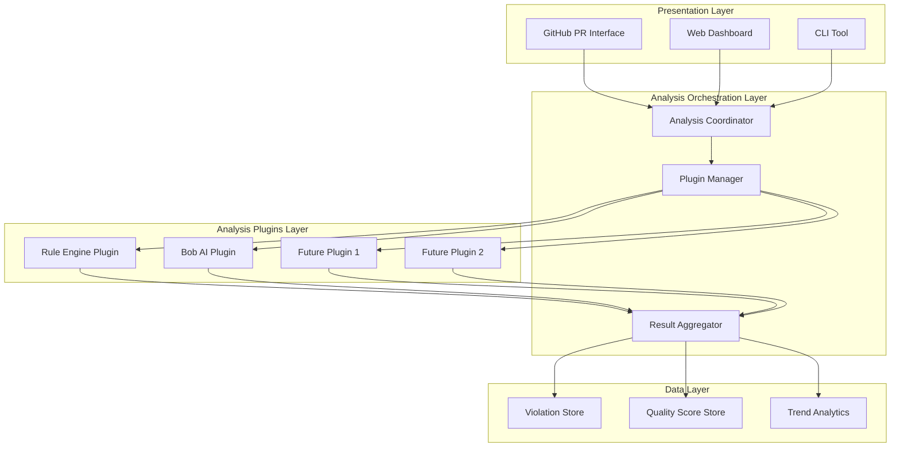

# 🔌 Extensibility Architecture

## Overview

This document outlines the extensible architecture that allows the code review system to grow from basic rule checking to advanced AI-powered analysis and beyond.

---

## 🏗️ Layered Architecture



---

## 🔧 Core Components

### 1. Analysis Coordinator

**Purpose**: Orchestrates the entire analysis pipeline

```python
# src/analyzer/coordinator.py

class AnalysisCoordinator:
    """Coordinates multi-tier analysis pipeline"""
    
    def __init__(self, config):
        self.config = config
        self.plugin_manager = PluginManager(config)
        self.result_aggregator = ResultAggregator()
    
    def analyze_pr(self, pr_number, files):
        """Run complete analysis pipeline"""
        results = {
            'pr_number': pr_number,
            'timestamp': datetime.now(),
            'tiers': {}
        }
        
        # Tier 1: Blocking Analysis (Rule Engine)
        tier1_result = self._run_tier1_analysis(files)
        results['tiers']['tier1'] = tier1_result
        
        # Check if we should proceed to Tier 2
        if tier1_result['should_block']:
            results['status'] = 'BLOCKED'
            results['reason'] = 'Critical violations found'
            return results
        
        # Tier 2: Advisory Analysis (AI)
        tier2_result = self._run_tier2_analysis(files)
        results['tiers']['tier2'] = tier2_result
        
        # Tier 3+: Future extensible tiers
        for tier_name, tier_plugin in self.plugin_manager.get_additional_tiers():
            results['tiers'][tier_name] = tier_plugin.analyze(files)
        
        # Aggregate results
        results['status'] = 'APPROVED'
        results['summary'] = self.result_aggregator.aggregate(results)
        
        return results
    
    def _run_tier1_analysis(self, files):
        """Run blocking rule-based analysis"""
        plugin = self.plugin_manager.get_plugin('rule_engine')
        return plugin.analyze(files)
    
    def _run_tier2_analysis(self, files):
        """Run advisory AI analysis"""
        plugin = self.plugin_manager.get_plugin('bob_ai')
        return plugin.analyze(files)
```

---

### 2. Plugin Manager

**Purpose**: Manages analyzer plugins with lifecycle control

```python
# src/analyzer/plugin_manager.py

from typing import Dict, List, Type
from abc import ABC, abstractmethod

class AnalyzerPlugin(ABC):
    """Base class for all analyzer plugins"""
    
    def __init__(self, config: dict):
        self.config = config
        self.enabled = config.get('enabled', True)
        self.priority = config.get('priority', 100)
    
    @abstractmethod
    def analyze(self, files: Dict[str, str]) -> dict:
        """Analyze files and return results"""
        pass
    
    @abstractmethod
    def get_name(self) -> str:
        """Return plugin name"""
        pass
    
    @abstractmethod
    def get_version(self) -> str:
        """Return plugin version"""
        pass
    
    def is_enabled(self) -> bool:
        """Check if plugin is enabled"""
        return self.enabled
    
    def validate_config(self) -> bool:
        """Validate plugin configuration"""
        return True


class PluginManager:
    """Manages analyzer plugins"""
    
    def __init__(self, config: dict):
        self.config = config
        self.plugins: Dict[str, AnalyzerPlugin] = {}
        self._load_plugins()
    
    def _load_plugins(self):
        """Load all configured plugins"""
        plugin_configs = self.config.get('plugins', {})
        
        for plugin_name, plugin_config in plugin_configs.items():
            if plugin_config.get('enabled', True):
                plugin_class = self._get_plugin_class(plugin_name)
                if plugin_class:
                    self.plugins[plugin_name] = plugin_class(plugin_config)
    
    def _get_plugin_class(self, plugin_name: str) -> Type[AnalyzerPlugin]:
        """Get plugin class by name"""
        plugin_map = {
            'rule_engine': RuleEnginePlugin,
            'bob_ai': BobAIPlugin,
            'sonarqube': SonarQubePlugin,
            'code_climate': CodeClimatePlugin,
            # Add more plugins here
        }
        return plugin_map.get(plugin_name)
    
    def register_plugin(self, name: str, plugin: AnalyzerPlugin):
        """Register a new plugin at runtime"""
        self.plugins[name] = plugin
    
    def get_plugin(self, name: str) -> AnalyzerPlugin:
        """Get plugin by name"""
        return self.plugins.get(name)
    
    def get_all_plugins(self) -> List[AnalyzerPlugin]:
        """Get all enabled plugins"""
        return [p for p in self.plugins.values() if p.is_enabled()]
    
    def get_additional_tiers(self) -> List[tuple]:
        """Get plugins for additional analysis tiers"""
        additional = []
        for name, plugin in self.plugins.items():
            if name not in ['rule_engine', 'bob_ai']:
                additional.append((name, plugin))
        return sorted(additional, key=lambda x: x[1].priority)
```

---

### 3. Plugin Implementations

#### Rule Engine Plugin (Tier 1)

```python
# src/analyzer/plugins/rule_engine_plugin.py

class RuleEnginePlugin(AnalyzerPlugin):
    """Rule-based analysis plugin (Tier 1 - Blocking)"""
    
    def __init__(self, config: dict):
        super().__init__(config)
        self.rule_engine = RuleEngine(config.get('rules_config'))
        self.blocking_severities = config.get('blocking_severities', ['CRITICAL', 'HIGH'])
    
    def get_name(self) -> str:
        return "Rule Engine"
    
    def get_version(self) -> str:
        return "1.0.0"
    
    def analyze(self, files: Dict[str, str]) -> dict:
        """Run rule-based analysis"""
        all_violations = []
        
        for file_path, content in files.items():
            if file_path.endswith('.java'):
                violations = self.rule_engine.analyze_file(file_path, content)
                all_violations.extend(violations)
        
        # Categorize violations
        categorized = self._categorize_violations(all_violations)
        
        # Determine if should block
        should_block = self._should_block(categorized)
        
        return {
            'plugin': self.get_name(),
            'version': self.get_version(),
            'violations': categorized,
            'should_block': should_block,
            'total_violations': len(all_violations),
            'blocking_count': categorized.get('CRITICAL', 0) + categorized.get('HIGH', 0)
        }
    
    def _categorize_violations(self, violations: List[dict]) -> dict:
        """Categorize violations by severity"""
        categorized = {}
        for violation in violations:
            severity = violation['severity']
            if severity not in categorized:
                categorized[severity] = []
            categorized[severity].append(violation)
        return categorized
    
    def _should_block(self, categorized: dict) -> bool:
        """Determine if PR should be blocked"""
        for severity in self.blocking_severities:
            if categorized.get(severity):
                return True
        return False
```

#### Bob AI Plugin (Tier 2)

```python
# src/analyzer/plugins/bob_ai_plugin.py

class BobAIPlugin(AnalyzerPlugin):
    """Bob AI analysis plugin (Tier 2 - Advisory)"""
    
    def __init__(self, config: dict):
        super().__init__(config)
        self.bob_analyzer = BobCodeAnalyzer(config.get('api_key'))
        self.quality_scorer = QualityScorer(self.bob_analyzer)
    
    def get_name(self) -> str:
        return "Bob AI Analyzer"
    
    def get_version(self) -> str:
        return "1.0.0"
    
    def analyze(self, files: Dict[str, str]) -> dict:
        """Run AI-powered analysis"""
        file_scores = {}
        all_recommendations = []
        
        for file_path, content in files.items():
            if file_path.endswith('.java'):
                # Analyze individual file
                score = self.quality_scorer.calculate_overall_score(
                    content, 
                    {'file_path': file_path}
                )
                file_scores[file_path] = score
                all_recommendations.extend(score['recommendations'])
        
        # Calculate aggregate score
        overall_score = self._calculate_aggregate_score(file_scores)
        
        return {
            'plugin': self.get_name(),
            'version': self.get_version(),
            'overall_score': overall_score,
            'grade': self._get_grade(overall_score),
            'file_scores': file_scores,
            'recommendations': self._prioritize_recommendations(all_recommendations),
            'should_block': False,  # Advisory only, never blocks
            'breakdown': self._calculate_breakdown(file_scores)
        }
    
    def _calculate_aggregate_score(self, file_scores: dict) -> float:
        """Calculate overall score from file scores"""
        if not file_scores:
            return 0.0
        
        total = sum(score['overall_score'] for score in file_scores.values())
        return round(total / len(file_scores), 2)
    
    def _get_grade(self, score: float) -> str:
        """Convert score to letter grade"""
        if score >= 90: return 'A+'
        if score >= 80: return 'A'
        if score >= 70: return 'B'
        if score >= 60: return 'C'
        if score >= 50: return 'D'
        return 'F'
    
    def _prioritize_recommendations(self, recommendations: List[dict]) -> List[dict]:
        """Sort and filter recommendations by priority"""
        # Sort by impact and priority
        sorted_recs = sorted(
            recommendations,
            key=lambda x: (x.get('impact', 0), x.get('priority', 0)),
            reverse=True
        )
        
        # Return top recommendations
        max_recommendations = self.config.get('max_recommendations', 10)
        return sorted_recs[:max_recommendations]
    
    def _calculate_breakdown(self, file_scores: dict) -> dict:
        """Calculate category breakdown"""
        categories = ['design_patterns', 'architecture', 'code_quality', 'best_practices']
        breakdown = {cat: [] for cat in categories}
        
        for file_path, score in file_scores.items():
            for category in categories:
                if category in score.get('breakdown', {}):
                    breakdown[category].append(score['breakdown'][category])
        
        # Calculate averages
        return {
            cat: round(sum(scores) / len(scores), 2) if scores else 0
            for cat, scores in breakdown.items()
        }
```

---

### 4. Future Plugin Examples

#### SonarQube Integration Plugin

```python
# src/analyzer/plugins/sonarqube_plugin.py

class SonarQubePlugin(AnalyzerPlugin):
    """SonarQube integration plugin"""
    
    def __init__(self, config: dict):
        super().__init__(config)
        self.sonar_url = config.get('sonar_url')
        self.sonar_token = config.get('sonar_token')
        self.priority = config.get('priority', 200)  # Run after Tier 1 & 2
    
    def get_name(self) -> str:
        return "SonarQube Analyzer"
    
    def get_version(self) -> str:
        return "1.0.0"
    
    def analyze(self, files: Dict[str, str]) -> dict:
        """Run SonarQube analysis"""
        # Trigger SonarQube scan
        scan_result = self._trigger_sonar_scan(files)
        
        # Fetch results
        issues = self._fetch_sonar_issues(scan_result['task_id'])
        
        return {
            'plugin': self.get_name(),
            'version': self.get_version(),
            'issues': issues,
            'quality_gate': scan_result['quality_gate'],
            'should_block': False,  # Advisory
            'metrics': scan_result['metrics']
        }
    
    def _trigger_sonar_scan(self, files: dict) -> dict:
        """Trigger SonarQube scan"""
        # Implementation
        pass
    
    def _fetch_sonar_issues(self, task_id: str) -> List[dict]:
        """Fetch issues from SonarQube"""
        # Implementation
        pass
```

#### Code Climate Plugin

```python
# src/analyzer/plugins/code_climate_plugin.py

class CodeClimatePlugin(AnalyzerPlugin):
    """Code Climate integration plugin"""
    
    def __init__(self, config: dict):
        super().__init__(config)
        self.api_token = config.get('api_token')
        self.priority = config.get('priority', 300)
    
    def get_name(self) -> str:
        return "Code Climate"
    
    def get_version(self) -> str:
        return "1.0.0"
    
    def analyze(self, files: Dict[str, str]) -> dict:
        """Run Code Climate analysis"""
        # Implementation
        pass
```

---

## 📋 Configuration System

### Master Configuration File

```yaml
# config/analyzer.yaml

analyzer:
  # Global settings
  parallel_analysis: true
  timeout: 300  # seconds
  cache_enabled: true
  
  # Plugin configuration
  plugins:
    rule_engine:
      enabled: true
      priority: 1  # Tier 1 - runs first
      blocking: true
      rules_config: config/rules.yaml
      blocking_severities:
        - CRITICAL
        - HIGH
    
    bob_ai:
      enabled: true
      priority: 2  # Tier 2 - runs after Tier 1 passes
      blocking: false
      api_key: ${BOB_API_KEY}
      max_recommendations: 10
      weights:
        design_patterns: 0.25
        architecture: 0.25
        code_quality: 0.25
        best_practices: 0.25
    
    sonarqube:
      enabled: false  # Optional
      priority: 3
      blocking: false
      sonar_url: ${SONAR_URL}
      sonar_token: ${SONAR_TOKEN}
    
    code_climate:
      enabled: false  # Optional
      priority: 4
      blocking: false
      api_token: ${CODE_CLIMATE_TOKEN}
  
  # Result aggregation
  aggregation:
    combine_scores: true
    weight_by_priority: true
    generate_summary: true
  
  # Reporting
  reporting:
    formats:
      - json
      - markdown
      - html
    post_to_pr: true
    update_dashboard: true
```

---

## 🔌 Plugin Development Guide

### Creating a New Plugin

1. **Create Plugin Class**

```python
# src/analyzer/plugins/my_plugin.py

from src.analyzer.plugin_manager import AnalyzerPlugin

class MyCustomPlugin(AnalyzerPlugin):
    """My custom analyzer plugin"""
    
    def __init__(self, config: dict):
        super().__init__(config)
        # Initialize your plugin
        self.my_setting = config.get('my_setting')
    
    def get_name(self) -> str:
        return "My Custom Analyzer"
    
    def get_version(self) -> str:
        return "1.0.0"
    
    def analyze(self, files: Dict[str, str]) -> dict:
        """Implement your analysis logic"""
        results = []
        
        for file_path, content in files.items():
            # Your analysis logic here
            result = self._analyze_file(content)
            results.append(result)
        
        return {
            'plugin': self.get_name(),
            'version': self.get_version(),
            'results': results,
            'should_block': False,  # Set based on your logic
            'summary': self._generate_summary(results)
        }
    
    def _analyze_file(self, content: str) -> dict:
        """Analyze individual file"""
        # Implementation
        pass
    
    def _generate_summary(self, results: List[dict]) -> dict:
        """Generate summary of results"""
        # Implementation
        pass
```

2. **Register Plugin**

```python
# src/analyzer/plugin_manager.py

def _get_plugin_class(self, plugin_name: str) -> Type[AnalyzerPlugin]:
    """Get plugin class by name"""
    plugin_map = {
        'rule_engine': RuleEnginePlugin,
        'bob_ai': BobAIPlugin,
        'my_custom': MyCustomPlugin,  # Add your plugin
        # ...
    }
    return plugin_map.get(plugin_name)
```

3. **Configure Plugin**

```yaml
# config/analyzer.yaml

plugins:
  my_custom:
    enabled: true
    priority: 5
    blocking: false
    my_setting: "value"
```

4. **Test Plugin**

```python
# tests/test_my_plugin.py

def test_my_plugin():
    config = {'my_setting': 'test_value'}
    plugin = MyCustomPlugin(config)
    
    files = {'test.java': 'public class Test {}'}
    result = plugin.analyze(files)
    
    assert result['plugin'] == 'My Custom Analyzer'
    assert 'results' in result
```

---

## 🎯 Extension Points

### 1. Custom Rules

```python
# src/analyzer/rules/custom/my_rule.py

from src.analyzer.rules.base import Rule

class MyCustomRule(Rule):
    """Custom rule implementation"""
    
    def __init__(self):
        super().__init__(
            rule_id='CUSTOM001',
            name='My Custom Rule',
            severity='MEDIUM',
            description='Description of my rule'
        )
    
    def check(self, file_path: str, content: str) -> List[dict]:
        """Implement rule logic"""
        violations = []
        # Your logic here
        return violations
```

### 2. Custom Scorers

```python
# src/analyzer/scorers/custom_scorer.py

class CustomScorer:
    """Custom scoring algorithm"""
    
    def calculate_score(self, analysis_results: dict) -> float:
        """Calculate custom score"""
        # Your scoring logic
        pass
```

### 3. Custom Reporters

```python
# src/analyzer/reporters/custom_reporter.py

class CustomReporter:
    """Custom report generator"""
    
    def generate_report(self, results: dict) -> str:
        """Generate custom report format"""
        # Your reporting logic
        pass
```

---

## 🔄 Workflow Integration

### GitHub Actions with Extensible Plugins

```yaml
name: Extensible Code Review

on:
  pull_request:
    types: [opened, synchronize, reopened]

jobs:
  analyze:
    runs-on: ubuntu-latest
    steps:
      - uses: actions/checkout@v3
      
      - name: Setup Python
        uses: actions/setup-python@v4
        with:
          python-version: '3.9'
      
      - name: Install Dependencies
        run: pip install -r requirements.txt
      
      - name: Run Analysis Pipeline
        env:
          BOB_API_KEY: ${{ secrets.BOB_API_KEY }}
          SONAR_TOKEN: ${{ secrets.SONAR_TOKEN }}
        run: |
          python src/analyzer/coordinator.py \
            --pr ${{ github.event.pull_request.number }} \
            --config config/analyzer.yaml \
            --output results.json
      
      - name: Process Results
        run: |
          python src/analyzer/result_processor.py \
            --input results.json \
            --pr ${{ github.event.pull_request.number }}
```

---

## 📊 Monitoring & Metrics

### Plugin Performance Tracking

```python
# src/analyzer/monitoring.py

class PluginMonitor:
    """Monitor plugin performance"""
    
    def __init__(self):
        self.metrics = {}
    
    def track_execution(self, plugin_name: str, duration: float, success: bool):
        """Track plugin execution"""
        if plugin_name not in self.metrics:
            self.metrics[plugin_name] = {
                'executions': 0,
                'total_duration': 0,
                'failures': 0
            }
        
        self.metrics[plugin_name]['executions'] += 1
        self.metrics[plugin_name]['total_duration'] += duration
        if not success:
            self.metrics[plugin_name]['failures'] += 1
    
    def get_metrics(self) -> dict:
        """Get performance metrics"""
        return {
            name: {
                'avg_duration': metrics['total_duration'] / metrics['executions'],
                'success_rate': 1 - (metrics['failures'] / metrics['executions']),
                'total_executions': metrics['executions']
            }
            for name, metrics in self.metrics.items()
        }
```

---

## 🚀 Future Extensibility

### Planned Extensions

1. **Multi-Language Support**
   - Python analyzer plugin
   - JavaScript/TypeScript plugin
   - Go analyzer plugin

2. **IDE Integration**
   - VSCode extension
   - IntelliJ plugin
   - Vim/Neovim integration

3. **Advanced AI Features**
   - Code generation suggestions
   - Automated refactoring
   - Test generation

4. **Team Analytics**
   - Developer skill tracking
   - Team quality metrics
   - Learning recommendations

5. **Enterprise Features**
   - Custom rule builder UI
   - Policy enforcement
   - Compliance tracking
   - Audit logging

---

**This extensible architecture ensures the system can grow and adapt to future needs! 🎯**