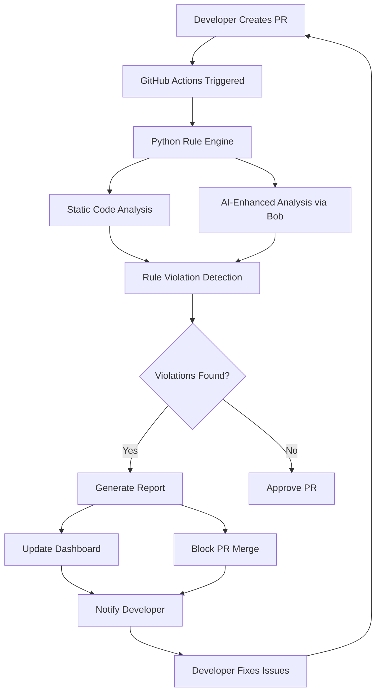

# AI-Powered Code Review System - IBM Bob-a-thon Project Plan

## 🎯 Project Overview

**Idea**: Streamlining the code review process using BOB  
**Track**: Track 1 - AI-Powered Development Tools  
**Timeline**: 1 Day (Comprehensive Solution)  
**Score**: 9/10 ⭐

### Expected Impact
- ⚡ **50-60% faster** code review cycles
- 📈 **30-40% improvement** in code quality
- 🎯 **Consistent** review standards across teams
- 🚀 **Enhanced** developer productivity
- 📚 **Accelerated** learning for junior developers

---

## 🏗️ System Architecture



---

## 📋 Refined Rule Set Analysis

### ✅ HIGH PRIORITY RULES (Critical - Must Implement)

| Rule | Validation Method | Complexity | Priority |
|------|------------------|------------|----------|
| IBM license/copyright header | Regex pattern match at file start | Low | P0 |
| No hardcoded secrets | Regex patterns for common secret patterns | Medium | P0 |
| No System.out/err.println | Simple string search | Low | P0 |
| No printStackTrace | Simple string search | Low | P0 |
| No TODO/FIXME comments | Regex pattern match | Low | P0 |
| No empty catch blocks | AST parsing or regex | Medium | P0 |
| No catching generic Exception | Regex with context | Medium | P0 |
| No SQL string concatenation | Pattern matching | Medium | P0 |
| No Runtime.exec with variables | Pattern matching | Medium | P0 |
| No hardcoded URLs | Regex for URL patterns | Low | P0 |
| No hardcoded file paths | Regex for path patterns | Low | P0 |
| No commented-out code | Multi-line comment detection | Medium | P0 |
| No logging sensitive data | Pattern matching in log statements | Medium | P0 |

### ✅ MEDIUM PRIORITY RULES (Important - Should Implement)

| Rule | Validation Method | Complexity | Priority |
|------|------------------|------------|----------|
| No wildcard imports | Regex pattern | Low | P1 |
| No duplicate imports | Set-based detection | Low | P1 |
| No unused imports | Requires dependency analysis | High | P2 |
| No trailing whitespace | Regex per line | Low | P1 |
| Max 2 consecutive blank lines | Line-by-line check | Low | P1 |
| Line length ≤ 120 chars | Simple length check | Low | P1 |
| File ends with newline | EOF check | Low | P1 |
| No debug flags | Pattern matching | Low | P1 |
| No System.exit | Simple string search | Low | P1 |
| No Thread.sleep | Simple string search | Low | P1 |
| No string concat in loops | Context-aware pattern | Medium | P1 |
| No == for String comparison | Pattern matching | Medium | P1 |
| No public fields | Regex with modifiers | Medium | P1 |
| No static mutable variables | Modifier analysis | Medium | P1 |

### ✅ NAMING RULES (Code Quality - Should Implement)

| Rule | Validation Method | Complexity | Priority |
|------|------------------|------------|----------|
| Lowercase package names | Regex pattern | Low | P1 |
| UpperCamelCase class names | Regex pattern | Low | P1 |
| lowerCamelCase method names | Regex pattern | Low | P1 |
| UPPER_SNAKE_CASE constants | Regex pattern | Low | P1 |
| No generic variable names | Blacklist check | Low | P1 |
| No single-char vars (except i,j,k) | Pattern with exceptions | Low | P1 |
| Boolean naming convention | Prefix check | Low | P1 |

### ✅ LOGGING RULES (Best Practices - Should Implement)

| Rule | Validation Method | Complexity | Priority |
|------|------------------|------------|----------|
| No string concat in logging | Pattern matching | Medium | P1 |
| Logger named log/logger | Variable name check | Low | P1 |

### ✅ EXCEPTION HANDLING (Critical - Must Implement)

| Rule | Validation Method | Complexity | Priority |
|------|------------------|------------|----------|
| Catch blocks not empty | Block content check | Medium | P0 |
| Exceptions must be logged | Pattern in catch blocks | Medium | P0 |
| No throwing generic Exception | Pattern matching | Low | P0 |
| No duplicate catch logic | Similarity detection | High | P2 |

### ✅ IMPORT & STRUCTURE (Code Organization - Should Implement)

| Rule | Validation Method | Complexity | Priority |
|------|------------------|------------|----------|
| Grouped imports | Order validation | Medium | P1 |
| No imports in class body | Position check | Low | P1 |
| One public class per file | Class count | Low | P1 |

### ⚠️ LOW PRIORITY RULES (Nice to Have - Optional)

| Rule | Validation Method | Complexity | Priority |
|------|------------------|------------|----------|
| No magic numbers | Number detection with context | High | P2 |
| No consecutive semicolons | Pattern matching | Low | P2 |
| No unnecessary parentheses | Expression parsing | High | P3 |
| No redundant boolean checks | Pattern matching | Medium | P2 |
| No empty methods | Method body check | Low | P2 |
| No hardcoded dates | Date pattern matching | Medium | P2 |
| No deprecated API usage | Annotation check | Medium | P2 |
| No @SuppressWarnings("all") | Annotation check | Low | P2 |

### 🆕 ADDITIONAL RECOMMENDED RULES

| Rule | Rationale | Complexity | Priority |
|------|-----------|------------|----------|
| No null pointer dereference patterns | Common NPE scenarios | Medium | P1 |
| Resource leak detection | Try-with-resources check | Medium | P1 |
| Proper exception chaining | Exception constructor check | Low | P1 |
| No swallowed exceptions | Empty catch or log-only | Medium | P1 |
| Synchronized block best practices | Lock scope analysis | High | P2 |
| No busy waiting loops | Pattern detection | Medium | P2 |
| Proper use of Optional | Optional misuse patterns | Medium | P2 |
| No mutable static collections | Collection type check | Medium | P1 |

---

## 🛠️ Technical Stack

### Core Components
- **Language**: Python 3.9+
- **Code Analysis**: Custom regex + AST parsing (javalang library)
- **AI Integration**: IBM Bob API/SDK
- **CI/CD**: GitHub Actions
- **Dashboard**: Flask/FastAPI + React/Vue.js
- **Database**: SQLite (for violation history)
- **Reporting**: Markdown + HTML generation

### Key Libraries
```python
# Python Dependencies
javalang          # Java AST parsing
regex             # Advanced pattern matching
flask/fastapi     # Web framework
jinja2            # Template engine
pygments          # Syntax highlighting
plotly/chart.js   # Visualization
requests          # API calls
pyyaml            # Configuration
```

---

## 📁 Project Structure

```
bobathon-code-review/
├── .github/
│   └── workflows/
│       └── code-review.yml          # GitHub Actions workflow
├── src/
│   ├── analyzer/
│   │   ├── __init__.py
│   │   ├── rule_engine.py           # Core rule validation
│   │   ├── java_parser.py           # Java code parsing
│   │   ├── rules/
│   │   │   ├── __init__.py
│   │   │   ├── high_priority.py     # P0 rules
│   │   │   ├── medium_priority.py   # P1 rules
│   │   │   ├── naming_rules.py      # Naming conventions
│   │   │   └── low_priority.py      # P2/P3 rules
│   │   └── ai_analyzer.py           # Bob AI integration
│   ├── dashboard/
│   │   ├── __init__.py
│   │   ├── app.py                   # Web server
│   │   ├── templates/
│   │   │   ├── index.html           # Main dashboard
│   │   │   └── report.html          # Violation report
│   │   └── static/
│   │       ├── css/
│   │       ├── js/
│   │       └── assets/
│   ├── github_integration/
│   │   ├── __init__.py
│   │   ├── pr_handler.py            # PR operations
│   │   └── status_updater.py        # Status checks
│   └── utils/
│       ├── __init__.py
│       ├── config.py                # Configuration
│       ├── logger.py                # Logging setup
│       └── report_generator.py      # Report creation
├── tests/
│   ├── test_rules.py
│   ├── test_analyzer.py
│   └── test_integration.py
├── sample-java-project/
│   ├── src/
│   │   └── main/
│   │       └── java/
│   │           └── com/
│   │               └── ibm/
│   │                   └── demo/
│   │                       ├── GoodCode.java
│   │                       └── BadCode.java  # Intentional violations
│   └── pom.xml
├── config/
│   ├── rules.yaml                   # Rule configuration
│   └── severity.yaml                # Severity levels
├── docs/
│   ├── SETUP.md
│   ├── RULES.md
│   └── API.md
├── requirements.txt
├── setup.py
├── README.md
└── LICENSE
```

---

## 🔄 Implementation Workflow

### Phase 1: Foundation (2-3 hours)
1. Set up project structure
2. Configure development environment
3. Create sample Java project with violations
4. Implement basic rule engine framework

### Phase 2: Core Analysis (3-4 hours)
1. Implement high-priority rules (P0)
2. Implement medium-priority rules (P1)
3. Add naming and logging rules
4. Integrate Java AST parsing

### Phase 3: AI Enhancement (2-3 hours)
1. Integrate Bob AI for semantic analysis
2. Generate AI-powered fix suggestions
3. Add contextual explanations
4. Implement learning from patterns

### Phase 4: GitHub Integration (2-3 hours)
1. Create GitHub Actions workflow
2. Implement PR status checks
3. Add PR blocking mechanism
4. Set up automated comments

### Phase 5: Dashboard (3-4 hours)
1. Build web-based dashboard
2. Add real-time violation display
3. Implement code snippet viewer
4. Create visualization charts
5. Add AI recommendations panel

### Phase 6: Testing & Polish (2-3 hours)
1. Write unit tests
2. Integration testing
3. End-to-end testing
4. Documentation
5. Demo preparation

---

## 🎨 Dashboard Features

### Main Dashboard View
- **Overview Panel**: Total violations, severity breakdown, trend charts
- **Recent PRs**: List of analyzed PRs with status
- **Rule Violations**: Grouped by category and severity
- **AI Insights**: Bob-generated recommendations
- **Code Quality Score**: Overall project health metric

### Detailed Report View
- **File-by-File Analysis**: Violations per file
- **Code Snippets**: Highlighted problematic code
- **Fix Suggestions**: AI-generated solutions
- **Rule Explanations**: Why it matters + how to fix
- **Historical Trends**: Violation patterns over time

### Interactive Features
- Filter by severity, category, file
- Search violations
- Export reports (PDF, HTML, JSON)
- Real-time updates during PR analysis

---

## 🤖 AI Enhancement Strategy

### Bob Integration Points

1. **Semantic Code Analysis**
   - Understand code intent beyond syntax
   - Detect logical errors and anti-patterns
   - Identify architectural issues

2. **Intelligent Fix Suggestions**
   - Generate context-aware code fixes
   - Provide multiple solution options
   - Explain trade-offs

3. **Educational Feedback**
   - Explain why violations matter
   - Link to best practices
   - Provide learning resources

4. **Pattern Recognition**
   - Learn from historical violations
   - Identify team-specific patterns
   - Suggest custom rules

5. **Priority Ranking**
   - AI-based severity assessment
   - Impact analysis
   - Fix effort estimation

---

## 📊 Success Metrics

### Quantitative Metrics
- **Review Speed**: Time from PR creation to approval
- **Violation Detection Rate**: Issues caught vs. missed
- **False Positive Rate**: Incorrect violations flagged
- **Code Quality Score**: Trend over time
- **Developer Satisfaction**: Survey results

### Qualitative Metrics
- **Code Consistency**: Adherence to standards
- **Knowledge Transfer**: Junior developer improvement
- **Review Quality**: Depth of human reviews
- **Team Productivity**: Time saved on reviews

---

## 🚀 Demo Strategy

### Live Demonstration Flow
1. **Setup**: Show GitHub repository with sample code
2. **Create PR**: Demonstrate PR with violations
3. **Automated Analysis**: Watch GitHub Actions run
4. **Dashboard View**: Show real-time violation detection
5. **AI Insights**: Display Bob's recommendations
6. **PR Blocking**: Show merge prevention
7. **Fix & Rerun**: Apply fixes and show approval
8. **Metrics**: Display impact statistics

### Key Talking Points
- Automation reduces review time by 50-60%
- AI catches issues humans miss
- Consistent standards across all code
- Educational feedback accelerates learning
- Scalable across multiple projects

---

## 🎯 Hackathon Presentation Structure

### 1. Problem Statement (2 min)
- Code review bottlenecks
- Inconsistent quality
- Senior developer time waste

### 2. Solution Overview (3 min)
- AI-powered automation
- GitHub integration
- Real-time dashboard

### 3. Live Demo (5 min)
- End-to-end workflow
- Dashboard features
- AI recommendations

### 4. Technical Deep Dive (3 min)
- Architecture
- Rule engine
- Bob integration

### 5. Impact & Metrics (2 min)
- Expected improvements
- Success metrics
- Scalability

### 6. Q&A (5 min)

---

## ⚠️ Risk Mitigation

### Technical Risks
- **AST Parsing Complexity**: Fallback to regex for complex cases
- **GitHub API Limits**: Implement caching and rate limiting
- **Dashboard Performance**: Use pagination and lazy loading
- **AI Response Time**: Cache common patterns

### Timeline Risks
- **Scope Creep**: Focus on P0/P1 rules first
- **Integration Issues**: Test early and often
- **Dashboard Complexity**: Use templates and libraries

---

## 🎓 Learning Outcomes

### Technical Skills
- Python code analysis techniques
- GitHub Actions workflow design
- AI integration patterns
- Web dashboard development

### Soft Skills
- Problem decomposition
- Time management
- Demo presentation
- Technical communication

---

## 📚 Resources & References

### Documentation
- GitHub Actions: https://docs.github.com/actions
- Java Language Spec: https://docs.oracle.com/javase/specs/
- IBM Bob API: [Internal documentation]

### Tools
- javalang: Java AST parsing
- Pygments: Syntax highlighting
- Chart.js: Data visualization

### Best Practices
- Google Java Style Guide
- Oracle Java Conventions
- IBM Secure Engineering

---

## ✅ Definition of Done

- [ ] All P0 rules implemented and tested
- [ ] GitHub Actions workflow functional
- [ ] PR blocking mechanism working
- [ ] Dashboard deployed and accessible
- [ ] AI integration providing recommendations
- [ ] Sample project demonstrating all features
- [ ] Documentation complete
- [ ] Demo presentation ready
- [ ] Code quality metrics visible
- [ ] End-to-end testing passed

---

**Ready to build something amazing! 🚀**